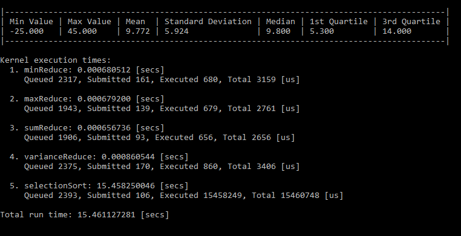

# Weather Analysis OpenCl C++

An application that retrieves temperature data from a text file and returns its statistical values using Parallel Programming in OpenCL and C++.

The application can be executed through the 'Local windows debugger' and acts as a console application.
All commands are clearly labelled when the applications start. For efficient statistical lookup on the large dataset, once the program has loaded input commands '2' and '2'.

Statistical results achieved on datasets (to 3 decimal places):
|  Statistics          | Small Dataset | Large Dataset |
|:--------------------:|:-------------:|:-------------:|
|  Minimum Value       |    -25.000    |    -25.000    |
|  Maximum Value       |     31.500    |     45.000    |
|  Mean Value          |      9.727    |      9.772    |
|  Standard Deviation  |      5.915    |      5.924    |
|  Median Value        |      9.800    |      9.800    |
|  1st Quartile        |      5.100    |      5.300    |
|  3rd Quartile        |     14.000    |     14.000    |

Additional information displayed within the console includes:

- Total records in file
- Local size
- Number of work-groups
- Padding increase value
- Number of records with padding increase
- Individual and total kernel execution times
- Profiling information: queued, submitted, executed and total

## Dependencies

This project requires a Microsoft Visual Studio 2019 environment, with the C++ programming language packages enabled. Additionally, it uses [Intel's OpenCL SDK](https://software.intel.com/content/www/us/en/develop/tools/opencl-sdk.html) that must be downloaded.

With the core packages install, OpenCL requires runtime drivers to run the OpenCL code on your computers hardware. Both Nvidia and AMD GPUs have OpenCL runtimes included with their card drivers. However for CPUs, you are required to install a dedicated driver by Intel, found [here](https://software.intel.com/content/www/us/en/develop/articles/opencl-drivers.html) (Intel® CPU Runtime for OpenCL™), or an APP SDK for older AMD processors.

A useful resource for getting OpenCL working on Windows can be found [here](https://streamhpc.com/blog/2015-03-16/how-to-install-opencl-on-windows/).
